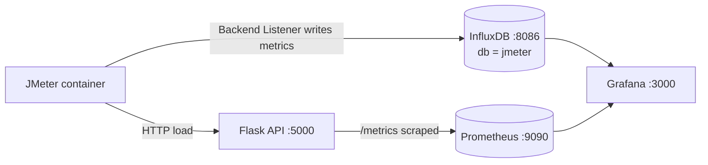

# JMeter + InfluxDB + Grafana Load Testing

This guide explains how load testing was added to the **Observability Shipping (Flask Logistics API)** stack, and how to run it.

The flow is:



JMeter pushes **client-side** results (throughput, response time, errors, active threads) into InfluxDB while the test runs. Grafana reads InfluxDB live, so you see the load test as it happens — next to the **server-side** Prometheus metrics from the API.

---

## 1. What was added

| File | Purpose |
|------|---------|
| `docker-compose.yml` | Added `influxdb` service and an on-demand `jmeter` service (profile `load`); Grafana now also mounts a dashboards folder |
| `config/grafana/provisioning/datasources/datasources.yml` | Added the `InfluxDB-JMeter` datasource, plus fixed UIDs for Prometheus / Tempo / Loki |
| `config/grafana/provisioning/dashboards/dashboards.yml` | New dashboard provider so dashboards auto-load from files |
| `config/grafana/dashboards/jmeter-load-test.json` | New dashboard: **JMeter Load Test - Logistics API** |
| `jmeter/test-plans/logistics-baseline.jmx` | Scenario 1: steady mixed read/write traffic |
| `jmeter/test-plans/logistics-spike.jmx` | Scenario 2: sudden traffic spike |
| `jmeter/test-plans/logistics-error-scenario.jmx` | Scenario 3: healthy traffic + deliberate 4xx errors |
| `jmeter/run-load-test.ps1` / `run-load-test.sh` | One-command runners |
| `jmeter/results/` | JTL files, JMeter logs and generated HTML reports |

Nothing in `app/` was changed — the API is the system under test.

---

## 2. New services

### InfluxDB

```yaml
influxdb:
  image: influxdb:1.8
  ports:
    - "8086:8086"
  environment:
    INFLUXDB_DB: jmeter
    INFLUXDB_HTTP_AUTH_ENABLED: "false"
```

InfluxDB **1.8** is used on purpose: JMeter's built-in `InfluxdbBackendListenerClient` speaks the InfluxDB v1 line-protocol write API (`/write?db=jmeter`). No token or extra plugin is needed.

### JMeter

The `jmeter` service is behind a Compose **profile** (`load`), so `docker compose up` does *not* start it. It runs once, writes results, then exits.

It talks to the other containers over the existing `observability` network:

- API host inside the network: `app:5000`
- InfluxDB host inside the network: `influxdb:8086`

---

## 3. Quick start

### Step 1 — start the stack

```powershell
cd C:\BootCamp\ObservabilityShipping_Python
docker compose up -d --build
```

Wait until the API answers:

```powershell
curl http://localhost:5000/health
```

### Step 2 — check InfluxDB is ready

```powershell
docker compose exec influxdb influx -execute "SHOW DATABASES"
```

You should see `jmeter` in the list.

### Step 3 — open the dashboard

Go to <http://localhost:3000> (`admin` / `admin`) →
**Dashboards → Load Testing → JMeter Load Test - Logistics API**

Direct link: <http://localhost:3000/d/jmeter-logistics>

Set the time range to **Last 15 minutes** and refresh to **10s** so you can watch it live.

### Step 4 — run a load test

PowerShell:

```powershell
cd C:\BootCamp\ObservabilityShipping_Python\jmeter
.\run-load-test.ps1
```

Bash / WSL:

```bash
cd ObservabilityShipping_Python/jmeter
chmod +x run-load-test.sh
./run-load-test.sh
```

Leave the Grafana dashboard open while it runs — data appears within ~5–10 seconds.

---

## 4. The three scenarios

### Scenario 1 — Baseline (`logistics-baseline.jmx`)

Steady "normal day" traffic. Run this first so you know what healthy looks like.

- **TG1 - Read Traffic** (default 10 threads): `GET /shipments`, `/customers`, `/carriers`, `/ports`, `/analytics/shipments/summary`
- **TG2 - Write Traffic** (default 3 threads): looks up a real customer + OCEAN route, then `POST /shipments`, adds a `BOOKED` tracking event and re-reads the shipment

```powershell
.\run-load-test.ps1 -Plan logistics-baseline.jmx -Threads 10 -Duration 300
```

Expect: flat throughput, low latency, near-zero errors.

### Scenario 2 — Spike (`logistics-spike.jmx`)

Warm-up traffic runs first; after 60 seconds an 80-thread burst hits `/shipments?size=100` and the carrier-performance analytics endpoint for 90 seconds.

```powershell
.\run-load-test.ps1 -Plan logistics-spike.jmx -Duration 300
```

Expect: a sharp step in **Active Threads**, p95/p99 climbing, and API p95 latency on the Prometheus panels rising at the same moment.

### Scenario 3 — Errors (`logistics-error-scenario.jmx`)

Healthy traffic plus a thread group that deliberately sends bad requests: unknown UUIDs (404) and an invalid shipment body (400).

```powershell
.\run-load-test.ps1 -Plan logistics-error-scenario.jmx -Duration 240
```

Expect: the **Errors per 10s** panel fills up, and the Prometheus **4xx/5xx rate** panel matches it.

---

## 5. Tuning a run

Both runners accept parameters, which are passed to JMeter as `-J` properties.

| Parameter | JMeter property | Default | Meaning |
|-----------|-----------------|---------|---------|
| `-Threads` | `threads` | 10 | Concurrent virtual users (read group) |
| `-RampUp` | `rampup` | 30 | Seconds to reach full thread count |
| `-Duration` | `test.duration` | 300 | Total test length in seconds |
| — | `write.threads` | 3 | Write-traffic threads (baseline plan) |
| — | `spike.threads` | 80 | Burst size (spike plan) |
| — | `spike.delay` | 60 | Seconds before the burst starts |
| — | `error.threads` | 4 | Bad-request threads (error plan) |

Example — heavier, shorter run:

```powershell
.\run-load-test.ps1 -Plan logistics-baseline.jmx -Threads 40 -RampUp 20 -Duration 120
```

To override a property that has no script switch, run Compose directly:

```powershell
docker compose --profile load run --rm jmeter `
  sh -c "jmeter -n -t /tests/logistics-spike.jmx -l /results/run.jtl -Japi.host=app -Jinfluxdb.host=influxdb -Jspike.threads=150"
```

---

## 6. Reading the dashboard

**JMeter panels (client side, from InfluxDB)**

| Panel | What it tells you |
|-------|-------------------|
| Total Requests / Failed Requests | Overall volume and failure count for the selected window |
| Avg Response Time | Mean latency as measured by the load generator |
| Peak Active Threads | How much concurrency was actually applied |
| Throughput by transaction | Requests/sec per sampler — spot which endpoint dominates |
| Active Threads | The load profile shape (ramp, plateau, spike) |
| Response Time avg by transaction | Which endpoint slows down first |
| Response Time percentiles | p90 / p95 / p99 — the numbers that matter for SLOs |
| Errors per 10s by transaction | Where and when failures happened |

**API panels (server side, from Prometheus)**

| Panel | What it tells you |
|-------|-------------------|
| API request rate by URI | Confirms the server actually received the load |
| API p95 latency by URI | Server-side latency — compare with JMeter's number |
| API 4xx/5xx rate | Whether failures are the app's fault |

**The key skill:** if JMeter latency is much higher than API p95 latency, the bottleneck is *outside* the app (queuing, connections, load generator). If both rise together, the app or database is the bottleneck.

From here, jump to **Loki** (logs, filtered by the same time window) and **Tempo** (traces) to find the root cause — those datasources are already wired up.

---

## 7. Underlying data model

JMeter's `InfluxdbBackendListenerClient` writes two measurements into the `jmeter` database:

**`jmeter`** — per-sampler aggregates every 5 seconds
- tags: `application` (`logistics-api`), `transaction` (sampler name, plus `all`), `statut` (`ok` / `ko` / `all`)
- fields: `count`, `avg`, `min`, `max`, `pct90.0`, `pct95.0`, `pct99.0`, `hit`

**`internal`** — load generator state
- fields: `minAT`, `maxAT`, `meanAT` (active threads), `startedT`, `endedT`

Example query used by the throughput panel:

```sql
SELECT sum("count") / 10 FROM "jmeter"
WHERE "statut" = 'all' AND "transaction" <> 'all' AND $timeFilter
GROUP BY time(10s), "transaction" fill(0)
```

Explore raw data any time:

```powershell
docker compose exec influxdb influx -database jmeter -execute "SHOW MEASUREMENTS"
docker compose exec influxdb influx -database jmeter -execute "SELECT * FROM jmeter LIMIT 5"
```

---

## 8. Results on disk

Every run writes timestamped files to `jmeter/results/`:

- `<timestamp>.jtl` — raw sample log
- `<timestamp>.log` — JMeter engine log
- `html-<timestamp>/index.html` — full JMeter HTML report

Open the HTML report in a browser for the classic APDEX / percentile tables. Grafana is for *live* monitoring; the HTML report is the *post-run* artifact.

---

## 9. Clearing data between runs

Old load-test data stays in InfluxDB. To wipe just the JMeter results:

```powershell
docker compose exec influxdb influx -execute "DROP DATABASE jmeter; CREATE DATABASE jmeter"
```

The existing `exercise-scripts/reset.ps1` still resets the app database and Prometheus; it does not touch InfluxDB.

---

## 10. Troubleshooting

| Problem | Fix |
|---------|-----|
| Dashboard is empty | Confirm the test is running (`docker compose --profile load ps`) and set the time range to *Last 15 minutes* |
| "Datasource not found" | `docker compose restart grafana` — provisioning is read at startup |
| JMeter cannot reach the API | Inside Docker the host is `app`, **not** `localhost`. The runners set `-Japi.host=app` |
| No data in InfluxDB | `docker compose exec influxdb influx -execute "SHOW DATABASES"` — the `jmeter` DB must exist |
| `jmeter` service not found | Remember the profile: `docker compose --profile load run --rm jmeter` |
| Image pull fails | Swap `justb4/jmeter:5.5` for another JMeter image (e.g. `alpine/jmeter`) in `docker-compose.yml` |
| HTML report step fails | The output dir must not exist; runs are timestamped, so just re-run |

Running JMeter from your host instead of Docker also works — point it at `localhost`:

```powershell
jmeter -n -t jmeter\test-plans\logistics-baseline.jmx -l results.jtl `
  -Japi.host=localhost -Japi.port=5000 -Jinfluxdb.host=localhost
```

---

## 11. Suggested exercise flow

1. Run **baseline** for 5 minutes → screenshot the dashboard. This is "normal".
2. Run **spike** → find the exact second latency degrades, and identify the slowest endpoint.
3. Run **error scenario** → correlate JMeter errors with Prometheus 4xx and Loki logs.
4. Increase `-Threads` until p95 exceeds 1 second → that is your current capacity limit.
